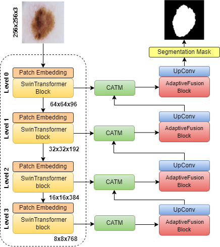

# ScaleFusionNet 
ScaleFusionNet is a Transformer-guided gulti-scale feature fusion network for Skin Lesion Segmentation. Melanoma is a malignant tumor originating from skin cell lesions. Accurate and efficient segmentation of skin lesions is essential for quantitative medical analysis but remains challenging. To address this, we propose ScaleFusionNet, a segmentation model that integrates Cross-Attention Transformer Module (CATM) and Adaptive Fusion Block (AFB) to enhance feature extraction and fusion. The model employs a hybrid architecture encoder that effectively captures both local and global features. We introduce CATM, which utilizes Swin Transformer Blocks and Cross Attention Fusion (CAF) to adaptively refine encoder-decoder feature fusion, reducing semantic gaps and improving segmentation accuracy. Additionally, the AFB is improved by integrating adaptive multiscale fusion, where Swin Transformer-based attention complements deformable convolution-based multi-scale feature extraction. This enhancement refines lesion boundaries and preserves fine-grained details. ScaleFusionNet achieves Dice scores of 92.94% and 91.80% on ISIC-2016 and ISIC-2018 datasets, respectively, demonstrating its effectiveness in skin lesion analysis.

# Features
## Hybrid CNN-Transformer architecture

  
  
## Cross-Attention Transformer Module (CATM)


## Adaptive Fusion Block (AFB)


## Installation
```bash
git clone https://github.com/sqbqamar/ScaleFusionNet.git
cd ScaleFusionNet
pip install -r requirements.txt
